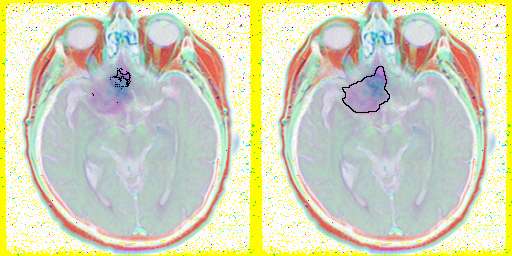
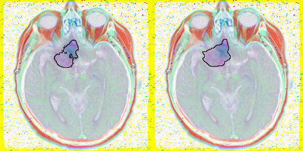

Federated Learning for Brain lower-grade glioma Segmentation
========

Dataset
--------

This dataset contains brain MR images together with manual FLAIR abnormality segmentation masks.
The images were obtained from The Cancer Imaging Archive (TCIA).
They correspond to 110 patients included in The Cancer Genome Atlas (TCGA) lower-grade glioma collection with at least fluid-attenuated inversion recovery (FLAIR) sequence and genomic cluster data available.

The final group of 110 patients was from the following 5 institutions:
Thomas Jefferson University (TCGA-CS, 16 patients), Henry Ford
Hospital (TCGA-DU, 45 patients), UNC (TCGA-EZ, 1 patient), Case
Western (TCGA-FG, 14 patients), Case Western – St. Joseph's (TCGAHT,
34 patients) from TCGA LGG collection.

Reference: Buda, M., Saha, A., & Mazurowski, M. A. (2019). Association of genomic subtypes of lower-grade gliomas with shape features automatically extracted by a deep learning algorithm. Computers in biology and medicine, 109, 218-225.

Step1: Centralized Brain Tumor(lower-grade glioma) Segmentation Training
--------

* mIOU By Each Models (Unet, MGUnet, DeeplabV3_Backbone) Backbone={Resnet101, Efficient-net}
 

    Above graph show us **U-net** is model which have the highest mIOU in Brain tumor data

* Loss By Each Models (Unet, MGUnet, DeeplabV3_Backbone)
 

    Look likes, All model are similar loss decling
# Guess
I thought that Data classification Loss from institutions is important feature of training. So I research the impact of classification loss by just adding the loss.

But there is negative impact of traing

Result:

    Above graph show us that Nomal Condition is better than using classifier of institutions condition

Classifier Condition

              prediction                          Label

              prediction                          Label

# Conclusion

General **U-net** is the best model in this experiment, and Normal condition(only training unet condition) is better than other condition, In brain lgg data.

Step2: Federated Leaning Brain Tumor(lower-grade glioma) Segmentation Training
---------