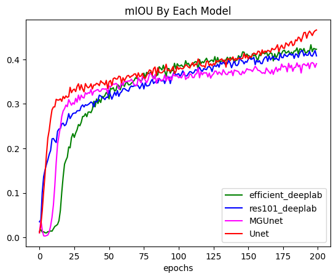
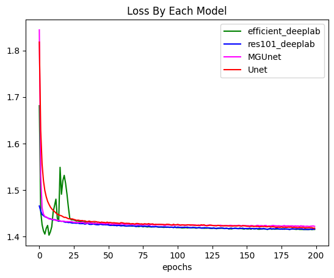

Federated Learning for Brain Tumor Segmentation
========

Step1: Centralized Brain Tumor Segmentation Training
--------

* mIOU By Each Models (Unet, MGUnet, DeeplabV3_Backbone)
 

    Above graph show us model which have the highest mIOU in Brain tumor data is **U-net**

* Loss By Each Models (Unet, MGUnet, DeeplabV3_Backbone)
 

    Look likes, All model are similar loss decling

Step2: Federated Leaning Brain Tumor Segmentation Training