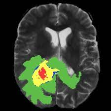
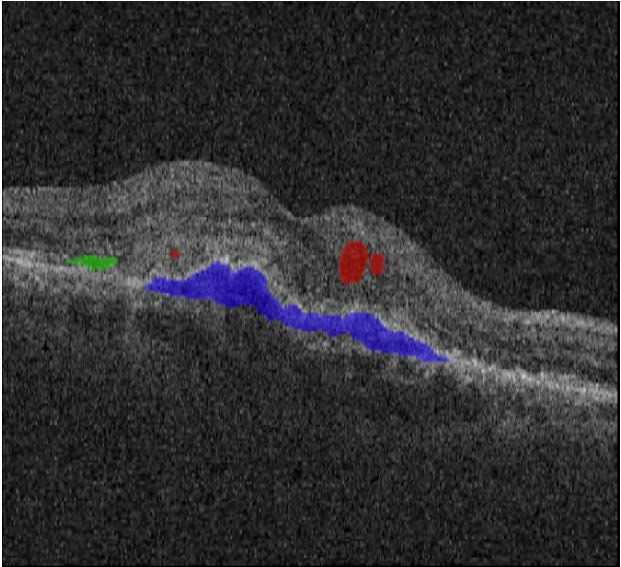

Dice-Coefficient Cross Entropy 기반 연합학습을
이용한 Lower-Grade Glioma 구획화
========
Lower-Grade Glioma Segmentation in
Dice-Coefficient Cross Entropy Weighted Federated Learning

Dataset
--------
MATEUSZ. (2023). Kaggle: Brain MRI segmentation Dataset.
https://www.kaggle.com/datasets/mateuszbuda/lgg-mrisegmentation

This dataset contains brain MR images together with manual FLAIR abnormality segmentation masks.
The images were obtained from The Cancer Imaging Archive (TCIA).
They correspond to 110 patients included in The Cancer Genome Atlas (TCGA) lower-grade glioma collection with at least fluid-attenuated inversion recovery (FLAIR) sequence and genomic cluster data available.

The final group of 110 patients was from the following 5 institutions:
Thomas Jefferson University (TCGA-CS, 16 patients), Henry Ford
Hospital (TCGA-DU, 45 patients), UNC (TCGA-EZ, 1 patient), Case
Western (TCGA-FG, 14 patients), Case Western – St. Joseph's (TCGAHT,
34 patients) from TCGA LGG collection.

Reference: Buda, M., Saha, A., & Mazurowski, M. A. (2019). Association of genomic subtypes of lower-grade gliomas with shape features automatically extracted by a deep learning algorithm. Computers in biology and medicine, 109, 218-225.

Paper
---------
본 논문은 연합학습을 이용한 Lower-Grade Glioma 구획화를 중점으로 연구하였다. 의료분야에서 구획화 과업은,
임상의의 보조진단 및 의료진단 시간절약을 가져와 준다. 하지만 개인정보를 많이 담고있는 의료 데이터 특성상 다른
병원 및 다른 임상의 사이에 데이터 공유는 매우 어렵다. 이에 데이터 공유 없이 학습 파라미터만을 공유하여 데이터
Privacy 를 보장하며 학습시킬 수 있는 연합학습 기법을 활용하여 구획화 모델학습 프레임워크를 제공하였다. 다만
기존의 연합학습은 중앙학습보다 성능이 다소 떨어진다는 점에서 한계점이 존재하였다. 이를 개선하기 위해 우리는
DCE (Dice-coefficient Cross Entropy) 수치를 통해 가중화된 연합학습을 제시한다. 이 메소드를 통해 기존 연합학습
(Fed-AVG) 보다 mIOU 수치가 6%, 좋은 모델성능을 보여준다.

### 1. 서론

본논문에서는 의료구획화 과업과 연합학습의 필요성 및 모
델의 정확도를 어떻게 더 향상시킬지에 관한 내용이다. 의
료인공지능 과업중 꾸준히 연구되고 있는것은 바로 구획화
(segmentation) 분야이다. 여기서 구획화란 Figure 1 과 같이
환자의 CT 이미지 혹은 MRI 같은 영상 데이터를통해 병변을
구분해주는 작업을 의미한다. 이를통해 전문의들은 직접적으
로 그려오던 과업을 인공지능기술을 통해 어느정도 보조를 받
을 수 있게 되었다.
<table>

Figure 1: (좌) 뇌종양 이미지 구획화, (우) OCT 에서 나이관
련 황반변성 구획화

</table>

의료데이터라는 것은 대부분환자의 개인 진료 결과물이다.
이런 데이터의 특성상 많은 개인정보를 담고 있어 다른 병원
이나 기관에게 공유하는것이 사실상 어렵다. 이런 어려움을 해
결하고자 우리는 연합학습을 사용하였다. 연합학습을 통해 다
른 병원들은 개인정보가 포함된 데이터 공유 없이도 단지 학습
파라미터만 전달하여 딥러닝 모델을 학습 시킬 수 있다 [1]. 그
러나 일반적인 연합학습에는 한계점들이 존재한다. 그 중에서
도 정확도가 기존 중앙집중형 학습보다 떨어진다는 점에 우리
는 집중하였다. 정확도를 올리기 위해 우리는 FeTs Challenge
2022 에서 좋은성적을 거둔 저자의 논문에 등장하는 cost 수
치를 통해 가중화된수집방법 (aggregation method) 을 응용
하여, 더 높은 정확도를 갖는 Dice-coefficient Cross Entropy
(DCE) 수치를 통해 가중화된 수집방법을 제시한다 [2].

### 2. 본론
본 논문에서는 뇌종양 구획화에서 주로 사용되는 전처리를
소개한다. 또한 중앙학습을 통한 U-Net 아키텍처 Fed-AVG,
CostW-AVG, 그리고 우리가 제시하는 연합학습방식의 성능비
교를 보여준다

- N3 Bias Field Correction 이미지 전처리: 

주로 MRI (Magnetic Resonance Imaging) 영상에서 나타
나는 강도 불균형 및 광택 현상을 보정하는데 사용된다. 이
러한 강도 불균형은 주로 조리개 효과, 감쇄, 그리고 자기장
비균일성과 같은 여러 요인에 의해 발생할 수 있다. N3 bias
field correction 은 Non-parametric Non-uniform intensity
Normalization 라는 용어의 약자로, 전통적인 매개 변수화
된 방법 (parameterized methods) 이 아닌 비매개 변수화된
(non-parametric) 방법을 사용하여 강도 불균형을 보정한다.

- U-Net 구획화 모델

모델은 2015 년에 학술 논문 ”U-Net: Convolutional Networks
for Biomedical Image Segmentation” 에서 소개되었
2024년도 한국통신학회 동계종합학술발표회
0757
다. 주로 의료이미지 병변구획화에서 성공적으로 사용되었다.
이 구조는 인코더 부분과 디코더 부분으로 나누어져 있다. 인
코더는 입력 이미지에서 공간적인 정보를 추출하고, 디코더는
이를 이용하여 고해상도의 구획화 맵을 생성한다 [3].

- Fed-AVG

클라이언트가 가지고 있는 샘플 데이터의 수가 많으면 많을
수록 수집되는 파라미터의 영향력이 많아진다. 다음과 같이 각
라운드 마다의 업데이트되는 가중합값 ( ω ) 을 나타낼수 있다.

$$\omega = \frac{1}{S}\sum\limits_{k\in\mathbb{C}} s_k\times M_k$$

여기서 $S$는 모든 데이터 샘플 개수이다. $s_k$는 $k$번째 클라이언트의 샘플개수이다. $M_k$는 $k$번째 클라이언트의 모델 학습 파라미터이다.
가장 기본이 되는 모델이지만, 특정 상황에서는 정확도가 떨어지는 단점이 있다 [1].

- FedCostW-AVG

최근 학습한 라운드의 모델의 cost 함수 값을 가지고 가중치
를 주는 방식이며 다음과 같이 나타낼 수 있다.

$$\omega = \sum\limits_{k\in\mathbb{C}} ( \alpha \times \frac{s_k}{S} + (1-\alpha)\times \frac{c_k}{C} )\times M_k$$

여기서C 는 수집된 클라이언트들의 cost 함수값의 합이며 ck
는 k 번째 클라이언트의 cost 함수값이다. 여기서 함수 ck 란
다음과 같이 정의 된다. t 는 라운드 스텝을 의미 한다.

$$c_k = \frac{c(M_{t-1})}{c(M_t)}$$

α 는 임의의 하이퍼파라미터 이다. 레퍼런스 논문에서는 α
를 0.5 로 설정하였다. 이런 전략을 통해 코스트값에 따른 가
중치를 가짐으로써 더 나은 성능의 모델이 학습되는것이 가능
하다 [2].

- __제안 알고리즘__ (CostW-AVG+CE, DCEW-AVG)

기존 CostW-AVG 방식의 경우 어떤 cost 함수를 사용하는지
에 따라 결과가 매우 달라진다는 특징이있었다. 그러나 레퍼런
스 논문에서는 구체적인 cost 함수를 제시하지 않았다 . 우리는,
cross entropy 를 구하고 sigmoid 함수를 거친값을 cost 함수
에 적용한 연합학습 CostW-AVG+CE 를 제안하였다.
또한, 특정상황에서 cross entropy 와 dice-coefficient 를
혼합하는 경우 성능이 향상될수 있다는 기존의 연구결과
[4] 를 토대로 연합학습에서도 가중치 값을 cross entropy
뿐만 아니라 dice-coefficient 값을 적용한 DCEW-AVG (Dice-
Coefficient Cross Entropy Weighted Federated Learning)
를 제안하였다. DCEW-AVG 의 학습 모델은 다음과 같이 업데
이트 된다.

$$\omega = \sum\limits_{k\in\mathbb{C}} ( \alpha \times \frac{s_k}{S} + \beta\times \frac{c_k}{C}+ \gamma\times \frac{d_k}{D} )\times M_k$$

여기서 $D$ 는수집된 클라이언트들의 dice-coefficient 함수값의
합이다. $d_k$ 는 $k$ 번째 클라이언트의 dice-coefficient 함수값이
다. 
함수 ${d_k}$ 의 정의는 $dk = \frac{d(Mt)}
{d(Mt−1)}$ 로 $c_k$ 의 분모 분자를 바꾼형태와 같다. $\alpha+\beta+\gamma=1$ 을 만족한다. 각각의 지
표는 하이퍼파라미터이며 실험에서는 각각 0.5, 0.25, 0.25 로 설정하였다.

<table border="1">
  <tr>
    <th>CL or FL</th>
    <th>method</th>
    <th>mIOU</th>
    <th>dice-coefficient</th>
  </tr>
  <tr>
    <td>CL</td>
    <td>U-NET</td>
    <td>37.45%</td>
    <td>54.49%</td>
  </tr>
  <tr>
    <td rowspan='3'>FL</td>
    <td>Fed-AVG</td>
    <td>30.17%</td>
    <td>46.32%</td>
  </tr>
  <tr>
    <td>CostW-AVG </td>
    <td>36.95%</td>
    <td>53.96%</td>
  </tr>
  <tr>
    <td>DCEW-AVG </td>
    <td>36.98%</td>
    <td>53.99%</td>
  </tr>
</table>

Table 1: 중앙집중형학습 (CL: Centralized Learning) 과 연합학습 (FL: Federated Learning)  
구조에서의 기존알고리즘과의 mIOU 및 dice-coefficient 값 비교

Table 1 은 Kaggle 의 Brain MRI Segmentation 데이터셋을
이용하여 실험한 결과들이다 [5]. 이를통해 기존의 연합학습보
다 mean Intersection over Union (mIOU) 가 6% 가량 향상한
것을 보여주었다. 이런 향상이 가능했던 이유는 기존 Fed-AVG
에서 이전 라운드에서 학습한 결과물을 다음 라운드에서는 망
각한채 학습되는 문제점을 CostW 와 DCEW 와 같은 전체 라운
드의 피드백을 받으며 학습되는 솔루션을 도입했기 때문이다.

### 결론
본논문에서는 연합학습을 통해 Lower-Grade Glioma 구획
화를 더 정확하게 수행하기 위해 dice 수치와 cost 수치를 추가
한 가중합 방안을 제시하였다. 이 방법을 통해 dice-coefficient
뿐만아니라 다른 기초 수치를 이용한 가중합으로 모델 성능이
향상될수 있는 가능성을 제시하였다.

### Reference
[1] MCMAHAN, Brendan, et al. ”Communication-efficient learning
of deep networks from decentralized data”. In: Artificial
intelligence and statistics. PMLR, 2017. p. 1273-1282.

[2] Mächler, L. et al. (2021). ”FedCostWAvg: A new averaging
for better Federated Learning.” In Proc. MICCAI Brainlesion
Workshop, France Sept. 2021.

[3] Ronneberger, O., et al. (2015). ”U-net: Convolutional networks
for biomedical image segmentation.” In Proc. MICCAI,
Munich, Germany, Oct. 2015.

[4] Huang, D. et al. (2021). ”Learning rich features with hybrid
loss for brain tumor segmentation.” BMC Medical Informatics
and Decision Making, vol. 21, article 63, 2021.

[5] MATEUSZ. (2023). Kaggle: Brain MRI segmentation Dataset.
https://www.kaggle.com/datasets/mateuszbuda/lgg-mrisegmentation
